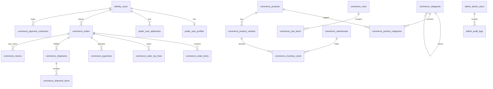

# Chic A Boo — Database Architecture v3.0 (FINAL · FROZEN)

**Status:** APPROVED FOR IMPLEMENTATION  
**Supersedes:** `ENTERPRISE_ARCHITECTURE.md` v2.0  
**Database:** PostgreSQL 15 (Supabase)  
**Effective:** 2026-06-22  
**Rule:** No migrations until this document is signed off by engineering lead.

---

## Part I — Principal Architect Review of v2.0

### 1. Schema design flaws (must fix)

| # | Flaw | Severity | v3.0 resolution |
|---|------|----------|------------------|
| F1 | **Seven schemas** with live data in `public` + planned `customer` migration breaks Supabase deployment | High | **4 schemas** only; keep customer tables in `public`, no rename migration |
| F2 | **`payments.order_id` implied UNIQUE** — blocks failed payment retries | Critical | Multiple `payments` rows per order; UNIQUE on `provider_payment_id` only |
| F3 | **Money as `NUMERIC(12,2)`** — Razorpay API uses **integer paise**; rounding drift at scale | Critical | All monetary columns → **`BIGINT` paise** (minor units) |
| F4 | **`products.category_id` single FK** — products belong in multiple categories | High | Add `catalog.product_categories` junction table; keep `primary_category_id` on product |
| F5 | **Duplicate audit** (`admin.audit_logs` + `platform.audit_logs`) | Medium | Single **`admin.audit_logs`** with `domain` column; remove unified duplicate |
| F6 | **`orders.deleted_at`** on financial records | High | **No soft delete on orders**; use `status = cancelled` only |
| F7 | **`coupon.usage_count` denormalized** — race under concurrent checkout | Medium | Remove counter; derive `COUNT(*)` from `coupon_usages` or lock row in transaction |
| F8 | **Global ERP columns** (`external_id`, `sync_status`) on every table | Low | Only on ERP-synced entities: products, variants, warehouses, stock |
| F9 | **Shipments without line items** — cannot model split fulfillment | High | Add `commerce.shipment_items` |
| F10 | **India GST not modeled** — `tax_total` alone insufficient for invoices | High | Add `commerce.order_tax_lines` (CGST/SGST/IGST breakdown) + `hsn_code` on `order_items` |
| F11 | **RLS on catalog tables** — FastAPI uses service role; RLS adds complexity with no benefit | Medium | Catalog/inventory: **RLS OFF**; enforce at API layer |
| F12 | **`platform.webhooks` outbound registry** conflated with inbound Razorpay events | Medium | Remove outbound table at launch; keep **`ops.webhook_events`** inbound only |
| F13 | **Cross-schema FK churn** (`inventory` → `commerce` reservations) complicates SQLAlchemy + migrations | Medium | Collapse inventory into `commerce` schema |
| F14 | **`refresh_tokens` + Redis dual-write** without clear primary | Medium | Redis = source of truth; DB table = **audit log only** (append, no read on hot path) |
| F15 | **Image `url` TEXT** — no R2 key discipline | Medium | `r2_key` + `media_assets` registry; never store presigned URLs |

### 2. Missing tables (production-required)

| Table | Why required |
|-------|--------------|
| `ops.idempotency_keys` | Safe retries: checkout, payment create, webhook handlers |
| `catalog.product_categories` | Many-to-many category assignment |
| `commerce.order_tax_lines` | GST invoice compliance (India) |
| `commerce.shipment_items` | Partial / multi-shipment fulfillment |
| `commerce.invoices` | Invoice number, PDF `r2_key`, GSTIN snapshot |
| `commerce.media_assets` | Central R2 object registry (products, avatars, invoices) |
| `commerce.stock_transfers` | Warehouse-to-warehouse transfer document (movements alone insufficient) |
| `commerce.review_votes` | Prevent `helpful_count` manipulation |
| `identity.consent_records` | Marketing / DPDP consent audit trail |
| `commerce.fulfillment_allocations` | Which warehouse fulfills each order line |

**Deferred (not launch-blocking):** `catalog.vendors`, `loyalty_transactions`, `gift_cards`, `price_rules`, outbound `webhooks` registry.

### 3. Over-engineering to remove or defer

| v2.0 item | v3.0 decision |
|-----------|---------------|
| 7 schemas | **4 schemas:** `identity`, `public`, `commerce`, `admin`, `ops` → actually let me consolidate to **4**: identity, public, commerce, admin — put ops in admin or public prefix `ops_*` |

Let me finalize 4 schemas:
- **identity** — auth
- **public** — customer profiles, addresses, preferences (existing, no migration)
- **commerce** — catalog + inventory + cart + orders + payments + everything transactional
- **admin** — RBAC + audit + admin sessions
- **ops** — append-only: webhook_events, idempotency_keys, notification_logs — OR merge ops into commerce

Principal decision: **5 schemas** is the v3 sweet spot (not 7):

| Schema | Contents |
|--------|----------|
| `identity` | Auth module (8 tables) |
| `public` | Customer module — **keep existing table names** |
| `commerce` | Catalog, inventory, cart, orders, payments, coupons, shipping, returns, reviews |
| `admin` | Admin RBAC, sessions, audit |
| `ops` | Idempotency, inbound webhooks, notification delivery logs only |

Removed/separated from v2:
- `customer` schema → stay in `public`
- `catalog` schema → merged into `commerce`
- `inventory` schema → merged into `commerce`
- `platform` schema → slimmed to `ops`
- `platform.user_events` → **removed** (PostHog is system of record)
- `platform.audit_logs` → **removed** (use `admin.audit_logs`)
- `platform.notifications` → **removed at DB layer** (Resend + Redis queue); keep `ops.notification_logs` for delivery audit
- `platform.webhooks` outbound → **removed**
- `identity.blocked_tokens` → **deferred** (Redis blacklist sufficient until compliance requires)
- Attribute EAV (4 tables) → **deferred**; use `product_variants.option_values` JSONB
- Multi-wishlist → **single wishlist per user** at launch (`commerce.wishlist_items` direct to user)
- Table partitioning → **deferred** until Supabase Pro + >2M rows in a log table
- `ltree` / materialized `path` on categories → keep `parent_id` + `path` TEXT maintained by trigger

### 4. PostgreSQL & Supabase limitations

| Limitation | Impact on v2.0 | v3.0 mitigation |
|------------|----------------|-----------------|
| `auth` schema reserved | Cannot use `auth.*` | `identity` schema (implemented) |
| **PgBouncer transaction mode** (port 6543) | No prepared statements; no `LISTEN/NOTIFY`; advisory locks unreliable | SQLAlchemy `statement_cache_size=0`; no LISTEN-based jobs |
| **Direct host IPv6-only** (`db.*.supabase.co`) | CLI migration failures on IPv4 networks | Migrations via **session pooler** `aws-1-ap-south-1:5432` (project-specific) |
| **pg_partman unavailable** on Supabase Free/Pro | Partition strategy in v2 not executable | Time-based **archival to cold storage** + indexed `created_at`; partition at self-host migration |
| **500 MB DB limit** (Free tier) | 60 tables + event store fills fast | No `user_events` table; aggressive log retention (90d) |
| **No read replica** (Free) | Analytics queries contend with OLTP | PostHog for analytics; heavy reports off peak or upgrade path documented |
| **Connection limits** | 4 FastAPI services + pooler | Small pools per service (5–10); single `DATABASE_URL` pooler endpoint |
| **RLS + service role** | RLS never evaluated for Backend/Admin | RLS only on **direct customer access paths**; document bypass via `chicaboo_service` role |
| **GENERATED `tsvector`** | Works on PG15; trigger safer for multi-column | **Trigger-maintained** `search_vector` on products |
| **Cross-schema FKs** | Supported | Allowed within `commerce`; `public` → `identity` FKs OK |
| **Supabase Storage** | Not used | Cloudflare R2 only; DB stores keys not URLs |

### 5. Stack integration requirements

#### FastAPI + SQLAlchemy 2.0 Async + asyncpg

- One async engine per service; `pool_size=5`, `max_overflow=10` on Render
- `connect_args={"statement_cache_size": 0}` for PgBouncer
- Explicit `__table_args__ = {"schema": "commerce"}` on all models
- Checkout / payment / inventory mutation: **single transaction** per request handler
- No cross-service DB transactions; use outbox or idempotency for sagas
- `SET LOCAL app.current_user_id` only in UserService customer-scoped reads

#### Supabase

- Migrations: session pooler port **5432**, user `postgres.{project_ref}`
- Runtime: transaction pooler port **6543** with `?pgbouncer=true`
- Role: `service_role` equivalent via direct Postgres connection string (not Supabase JS client)
- Never enable Supabase Auth tables for app users

#### Razorpay

- Store amounts as **BIGINT paise**
- `commerce.payments.provider_order_id` = Razorpay Order ID (`order_*`)
- `commerce.payments.provider_payment_id` = Razorpay Payment ID (`pay_*`)
- `ops.webhook_events.provider_event_id` = Razorpay `x-razorpay-event-id` header OR payload `event.id`
- Multiple `payments` rows per `order_id` (failed attempts kept)
- `payment_status` on `orders` derived from latest successful payment
- Refunds: always link `commerce.refunds` → `payments` + `provider_refund_id`

#### Cloudflare R2

- `commerce.media_assets`: `id`, `r2_key`, `bucket`, `content_type`, `byte_size`, `checksum`, `created_at`
- `product_images.asset_id` FK → `media_assets`; never store signed URLs in DB
- Avatars: `customer.profiles.avatar_asset_id` or keep `avatar_r2_key` TEXT on profile
- Invoices: `commerce.invoices.pdf_r2_key`

#### Upstash Redis

| Concern | Redis | PostgreSQL |
|---------|-------|------------|
| Active cart | `cart:{user_id}` primary | `commerce.carts` persisted at checkout start only |
| Refresh token | `rt:{user_id}:{jti}` primary | `identity.refresh_tokens` audit append |
| OTP | `otp:email:{email}` | `identity.email_verifications` backup |
| Idempotency (hot) | `idem:{key}` TTL 24h | `ops.idempotency_keys` permanent record |
| Product cache | `product:{slug}` | — |
| Rate limits | `rl:*` | — |
| Token blacklist | `blacklist:{jti}` | deferred |

---

## Part II — v3.0 Architecture Decisions (Frozen)

### ADR-001: Four operational schemas + `public` for customer

```
identity   → authentication & security
public     → customer profiles, addresses, preferences (EXISTING — no move)
commerce   → catalog, inventory, cart, orders, payments, promotions, fulfillment
admin      → RBAC, admin users, sessions, audit logs
ops        → idempotency, inbound webhooks, notification delivery logs
```

**Total tables at launch: ~48** (down from ~60)

### ADR-002: Money in paise (BIGINT)

All prices, totals, discounts, refunds, tax amounts: **`BIGINT NOT NULL`** storing INR paise.  
Display layer: `amount_paise / 100`. Razorpay API mapping is 1:1.

### ADR-003: Orders are immutable financial records

- No `deleted_at` on `orders`, `order_items`, `payments`, `payment_transactions`, `refunds`
- Cancellation = status change + `order_status_history` row

### ADR-004: Single audit trail

`admin.audit_logs` extended with `domain`, `actor_type`, `service_name`.  
Domain history tables (`order_status_history`, `inventory.movements`) remain separate.

### ADR-005: Analytics outside PostgreSQL

PostHog captures `page_view`, `product_viewed`, `add_to_cart`, `checkout_started`, `order_completed`.  
No `user_events` table in PostgreSQL at launch.

### ADR-006: Notifications outside PostgreSQL (mostly)

Transactional email via Resend + BullMQ on Redis.  
`ops.notification_logs` records delivery outcome only (audit).  
In-app notifications deferred until mobile app (can use Redis or add `commerce.notifications` later).

### ADR-007: Catalog search

- Trigger-updated `search_vector TSVECTOR` on `commerce.products`
- GIN on `search_vector`; GIN `pg_trgm` on `products.name`, `product_variants.sku`
- Redis cache for PDP; DB is search source of truth

### ADR-008: RLS minimal footprint

| RLS ON | RLS OFF |
|--------|---------|
| `identity.users` | All `commerce.*` |
| `public.user_profiles` | All `admin.*` |
| `public.user_addresses` | All `ops.*` |
| `public.user_preferences` | All `identity` except `users` |
| `commerce.carts`, `cart_items` (authenticated) | |
| `commerce.orders`, `order_items` (SELECT own) | |
| `commerce.wishlist_items` (SELECT/INSERT/DELETE own) | |
| `commerce.reviews` (SELECT approved + own pending) | |

Guest cart: service-layer token validation, not RLS.

### ADR-009: Idempotency is mandatory for write paths

`ops.idempotency_keys`: `(key TEXT PK, scope TEXT, request_hash TEXT, response_code INT, response_body JSONB, created_at, expires_at)`

Scopes: `checkout`, `payment_init`, `webhook_razorpay`, `refund_create`

### ADR-010: ERP / marketplace hooks without premature tables

- `commerce.products.vendor_id` UUID NULL — no `vendors` table until marketplace
- `external_id` + `sync_status` on: `products`, `product_variants`, `warehouses`, `inventory_stock` only

---

## Part III — Schema Layout & ERD

### 3.1 ERD (v3.0)



### 3.2 Table inventory (48 tables)

#### `identity` (7 tables — `blocked_tokens` deferred)

| Table | Status |
|-------|--------|
| `users` | ✅ Implemented |
| `refresh_tokens` | ✅ Implemented (audit role) |
| `email_verifications` | ✅ as `email_otps` — rename in migration |
| `password_resets` | ✅ Implemented |
| `security_logs` | ✅ Implemented |
| `user_devices` | ✅ Implemented |
| `login_history` | ✅ Implemented |
| `consent_records` | 🆕 Launch |

#### `public` (3 tables — keep names, no schema move)

| Table | Status |
|-------|--------|
| `user_profiles` | ✅ Implemented |
| `user_addresses` | ✅ Implemented |
| `user_preferences` | ✅ Implemented — **merge communication prefs here** (add columns) |

#### `commerce` (32 tables)

| Group | Tables |
|-------|--------|
| Media | `media_assets` |
| Catalog | `categories`, `products`, `product_categories`, `product_variants`, `product_images`, `product_tags`, `product_tag_mappings` |
| Inventory | `warehouses`, `inventory_stock`, `inventory_movements`, `stock_reservations`, `stock_transfers`, `fulfillment_allocations` |
| Cart | `carts`, `cart_items` |
| Wishlist | `wishlist_items` (user_id direct — no wishlists table) |
| Orders | `orders`, `order_items`, `order_tax_lines`, `order_status_history`, `invoices` |
| Payments | `payment_customers`, `payments`, `payment_transactions`, `refunds` |
| Promotions | `coupons`, `coupon_usages` |
| Shipping | `shipments`, `shipment_items`, `shipment_tracking_events` |
| Returns | `returns`, `return_items` |
| Reviews | `reviews`, `review_images`, `review_votes` |

#### `admin` (5 tables)

| Table | Status |
|-------|--------|
| `admin_users` | ✅ Implemented |
| `roles` | ✅ Implemented |
| `permissions` | ✅ Implemented |
| `role_permissions` | ✅ Implemented |
| `admin_sessions` | ✅ Implemented |
| `audit_logs` | ✅ Implemented — extended columns |

#### `ops` (3 tables)

| Table | Purpose |
|-------|---------|
| `idempotency_keys` | Write deduplication |
| `webhook_events` | Inbound Razorpay (+ future) |
| `notification_logs` | Resend delivery audit |

---

## Part IV — Module Specifications (v3.0)

*Conventions: UUID PK · TIMESTAMPTZ UTC · TEXT · JSONB metadata where noted · BIGINT paise for money · CHECK not ENUM · soft delete via `deleted_at` unless stated IMMUTABLE.*

---

### MODULE 1 — AUTH (`identity`)

Unchanged from v1.1 implementation except:

**`identity.consent_records`** (new)

| Column | Type |
|--------|------|
| `id` | UUID PK |
| `user_id` | UUID FK → `identity.users` |
| `consent_type` | TEXT — `marketing_email`, `marketing_sms`, `terms`, `privacy` |
| `granted` | BOOLEAN |
| `ip_address` | TEXT |
| `user_agent` | TEXT |
| `source` | TEXT — `registration`, `preferences`, `checkout` |
| `created_at` | TIMESTAMPTZ |

Append-only preference history. Current prefs still on `public.user_preferences`.

**`identity.email_verifications`:** rename from `email_otps`; add `email_normalized`, `purpose`.

**`identity.refresh_tokens`:** document as audit-only; add optional `device_id` FK.

**Deferred:** `blocked_tokens`

---

### MODULE 2 — CUSTOMER (`public`)

**No schema migration.** Extend `public.user_preferences`:

| Added column | Type |
|--------------|------|
| `email_marketing` | BOOLEAN DEFAULT FALSE |
| `sms_marketing` | BOOLEAN DEFAULT FALSE |
| `push_notifications` | BOOLEAN DEFAULT TRUE |
| `order_updates_email` | BOOLEAN DEFAULT TRUE |
| `order_updates_sms` | BOOLEAN DEFAULT FALSE |

Remove v2 `customer.communication_preferences` table.

**`public.user_profiles`:** add `avatar_r2_key` TEXT (replaces URL string); optional `loyalty_points`, `loyalty_tier` for readiness.

---

### MODULE 3 — ADMIN (`admin`)

**`admin.audit_logs`** — extend (do not duplicate):

| Added column | Type |
|--------------|------|
| `domain` | TEXT — `catalog`, `inventory`, `order`, `payment`, `user`, `admin` |
| `actor_type` | TEXT — `admin`, `user`, `system` |
| `service_name` | TEXT — `admin`, `backend`, `userservice` |
| `correlation_id` | TEXT |

Existing: `request_id`, `user_agent`, `target_user_id` ✅

**`admin.admin_users`:** add `last_login_at`, `password_changed_at`; fix `status` CHECK to exclude `super_admin` (role-only).

---

### MODULE 4 — CATEGORY (`commerce`)

#### `commerce.categories`

| Column | Type | Notes |
|--------|------|-------|
| `id` | UUID PK | |
| `parent_id` | UUID FK self NULL | |
| `name` | TEXT NOT NULL | |
| `slug` | TEXT NOT NULL | UNIQUE partial |
| `description` | TEXT | |
| `image_r2_key` | TEXT NULL | |
| `sort_order` | INTEGER DEFAULT 0 | |
| `status` | TEXT | `active`, `inactive` |
| `path` | TEXT | trigger-maintained |
| `depth` | INTEGER DEFAULT 0 | |
| `seo_title`, `seo_description` | TEXT | |
| `search_vector` | TSVECTOR | trigger-maintained |
| `metadata` | JSONB | |
| `created_at`, `updated_at`, `deleted_at` | TIMESTAMPTZ | |

**Indexes:** `slug` unique partial, `parent_id`, `path`, GIN `search_vector`, GIN trgm `name`

---

### MODULE 5 — PRODUCT CATALOG (`commerce`)

#### `commerce.media_assets`

| Column | Type |
|--------|------|
| `id` | UUID PK |
| `r2_key` | TEXT UNIQUE NOT NULL |
| `bucket` | TEXT DEFAULT `chicaboo-assets` |
| `content_type` | TEXT |
| `byte_size` | BIGINT |
| `width`, `height` | INTEGER NULL |
| `checksum` | TEXT NULL |
| `created_at` | TIMESTAMPTZ |

#### `commerce.products`

| Column | Type |
|--------|------|
| `id` | UUID PK |
| `primary_category_id` | UUID FK → categories |
| `vendor_id` | UUID NULL | marketplace placeholder |
| `name`, `slug` | TEXT |
| `description`, `short_description` | TEXT |
| `brand` | TEXT |
| `status` | TEXT — `draft`, `active`, `inactive` |
| `is_featured` | BOOLEAN |
| `tax_class` | TEXT — `gst_5`, `gst_12`, `gst_18`, `gst_28`, `exempt` |
| `hsn_code` | TEXT |
| `search_vector` | TSVECTOR |
| `seo_title`, `seo_description` | TEXT |
| `published_at` | TIMESTAMPTZ |
| `external_id`, `sync_status`, `last_synced_at` | ERP nullable |
| `metadata` | JSONB |
| `created_at`, `updated_at`, `deleted_at` | TIMESTAMPTZ |

**Note:** No `base_price` on product — price lives on variant only.

#### `commerce.product_categories` (new — fixes F4)

| Column | Type |
| `product_id` | UUID FK |
| `category_id` | UUID FK |
| `is_primary` | BOOLEAN DEFAULT FALSE |

**PK:** `(product_id, category_id)`

#### `commerce.product_variants`

| Column | Type |
| `id` | UUID PK |
| `product_id` | UUID FK |
| `sku` | TEXT UNIQUE partial |
| `barcode` | TEXT UNIQUE partial nullable |
| `title` | TEXT |
| `option_values` | JSONB — `{"color":"Red","size":"M"}` |
| `price_paise` | BIGINT NOT NULL |
| `compare_at_price_paise` | BIGINT NULL |
| `cost_price_paise` | BIGINT NULL |
| `weight_grams` | INTEGER |
| `status` | TEXT |
| `external_id`, `sync_status`, `last_synced_at` | ERP nullable |
| `metadata` | JSONB |
| `created_at`, `updated_at`, `deleted_at` | TIMESTAMPTZ |

#### `commerce.product_images`

| Column | Type |
| `id` | UUID PK |
| `product_id` | UUID FK |
| `variant_id` | UUID FK NULL |
| `asset_id` | UUID FK → `media_assets` |
| `alt_text` | TEXT |
| `sort_order` | INTEGER |
| `is_primary` | BOOLEAN |
| `created_at`, `deleted_at` | TIMESTAMPTZ |

#### `commerce.product_tags` / `commerce.product_tag_mappings`

Unchanged from v2.

**Deferred:** `attributes`, `attribute_values`, `product_attribute_values` (use JSONB `option_values`)

---

### MODULE 6 — INVENTORY (`commerce`)

#### `commerce.warehouses`

Same as v2; ERP fields only here.

#### `commerce.inventory_stock`

| Column | Type |
| `warehouse_id` + `variant_id` | UNIQUE |
| `quantity_on_hand` | INTEGER ≥ 0 |
| `quantity_reserved` | INTEGER ≥ 0 |
| `low_stock_threshold` | INTEGER |
| `updated_at` | TIMESTAMPTZ |

**Remove GENERATED column** — compute `available = on_hand - reserved` in queries or view `commerce.inventory_stock_available` to avoid STORED column migration quirks.

#### `commerce.inventory_movements`

Append-only audit — unchanged logic.

#### `commerce.stock_reservations`

Unchanged; FK to `commerce.orders` and `commerce.carts`.

#### `commerce.stock_transfers` (new)

| Column | Type |
| `id` | UUID PK |
| `from_warehouse_id`, `to_warehouse_id` | UUID FK |
| `status` | TEXT — `draft`, `in_transit`, `completed`, `cancelled` |
| `admin_id` | UUID FK |
| `notes` | TEXT |
| `created_at`, `completed_at` | TIMESTAMPTZ |

Movements reference `stock_transfers.id` as `reference_id`.

#### `commerce.fulfillment_allocations` (new)

| Column | Type |
| `id` | UUID PK |
| `order_item_id` | UUID FK |
| `warehouse_id` | UUID FK |
| `quantity` | INTEGER |
| `status` | TEXT — `allocated`, `picked`, `shipped`, `cancelled` |
| `created_at`, `updated_at` | TIMESTAMPTZ |

---

### MODULE 7 — CART (`commerce`)

**Redis-primary pattern:**

- `commerce.carts` row created when guest begins checkout OR user cart exceeds Redis TTL
- `cart_items` mirror at checkout snapshot

| `commerce.carts` | Notes |
|------------------|-------|
| `user_id` OR `guest_token` | CHECK one required |
| `status` | `active`, `converted`, `abandoned`, `expired` |
| `currency` | `INR` |
| `coupon_id` | FK nullable |
| Totals in **paise** | `subtotal_paise`, `discount_paise` |
| `expires_at` | TIMESTAMPTZ |
| No `deleted_at` on converted carts | status only |

---

### MODULE 8 — WISHLIST (`commerce`)

**Simplified:** `commerce.wishlist_items` only

| Column | Type |
| `id` | UUID PK |
| `user_id` | UUID FK |
| `product_id` | UUID FK |
| `variant_id` | UUID FK NULL |
| `created_at` | TIMESTAMPTZ |

**UNIQUE:** `(user_id, product_id, variant_id)`

Defer multi-wishlist / share tokens.

---

### MODULE 9 — ORDERS (`commerce`)

#### `commerce.orders` — IMMUTABLE (no `deleted_at`)

| Column | Type |
| `order_number` | BIGINT UNIQUE seq from 1000001 |
| `user_id` | UUID NULL |
| `guest_email` | TEXT NULL |
| `status` | TEXT — lifecycle per v2 |
| `payment_status` | TEXT |
| `fulfillment_status` | TEXT |
| `currency` | TEXT DEFAULT INR |
| `subtotal_paise`, `discount_paise`, `tax_paise`, `shipping_paise`, `grand_total_paise` | BIGINT |
| `coupon_id`, `coupon_code` | snapshot |
| `shipping_address`, `billing_address` | JSONB snapshots |
| `gstin` | TEXT NULL — B2B |
| `customer_note`, `admin_note` | TEXT |
| `cancelled_at`, `cancellation_reason` | |
| `metadata` | JSONB |
| `created_at`, `updated_at` | TIMESTAMPTZ — **no deleted_at** |

#### `commerce.order_items`

Add: `hsn_code` TEXT, `tax_rate_bps` INTEGER (basis points, e.g. 1800 = 18%), `unit_price_paise`, `line_total_paise`

#### `commerce.order_tax_lines` (new)

| Column | Type |
| `id` | UUID PK |
| `order_id` | UUID FK |
| `tax_type` | TEXT — `cgst`, `sgst`, `igst`, `cess` |
| `tax_rate_bps` | INTEGER |
| `taxable_amount_paise` | BIGINT |
| `tax_amount_paise` | BIGINT |
| `created_at` | TIMESTAMPTZ |

#### `commerce.order_status_history`

Append-only — unchanged.

#### `commerce.invoices` (new)

| Column | Type |
| `id` | UUID PK |
| `order_id` | UUID FK UNIQUE |
| `invoice_number` | BIGINT UNIQUE seq |
| `pdf_r2_key` | TEXT |
| `issued_at` | TIMESTAMPTZ |
| `metadata` | JSONB |

---

### MODULE 10 — PAYMENTS (`commerce`)

#### `commerce.payment_customers`

Move from `public` → `commerce` schema in migration. Structure unchanged.

#### `commerce.payments` — **multiple per order allowed**

| Column | Type |
| `order_id` | UUID FK — **NOT UNIQUE** |
| `attempt_number` | INTEGER DEFAULT 1 |
| `provider` | TEXT `razorpay` |
| `provider_order_id` | TEXT — Razorpay order_id |
| `provider_payment_id` | TEXT UNIQUE NULL |
| `amount_paise` | BIGINT |
| `status` | TEXT |
| `method` | TEXT |
| `failure_reason` | TEXT |
| `metadata` | JSONB |
| `created_at`, `updated_at` | TIMESTAMPTZ |

**UNIQUE:** `(order_id, attempt_number)`

#### `commerce.payment_transactions` — append-only ledger

#### `commerce.refunds`

`amount_paise` BIGINT; link `return_id` optional.

---

### MODULE 11 — COUPONS (`commerce`)

**Remove `usage_count`** from `coupons`.  
Keep `coupon_usages` as source of truth.

`target_ids UUID[]` → replace with **`commerce.coupon_targets`** junction if needed; at launch use `applies_to` + single `target_id` UUID nullable to avoid array indexing pain.

| `applies_to` | `target_id` |
| `all` | NULL |
| `category` | category UUID |
| `product` | product UUID |
| `customer` | user UUID |

---

### MODULE 12 — SHIPPING (`commerce`)

#### `commerce.shipments` + **`commerce.shipment_items`** (new)

**shipment_items:**

| Column | Type |
| `shipment_id` | UUID FK |
| `order_item_id` | UUID FK |
| `quantity` | INTEGER |

Supports split shipments.

#### `commerce.shipment_tracking_events`

Append-only — unchanged.

---

### MODULE 13 — RETURNS (`commerce`)

Unchanged structure; amounts in paise.

---

### MODULE 14 — REVIEWS (`commerce`)

#### `commerce.review_votes` (new)

| Column | Type |
| `review_id` | UUID FK |
| `user_id` | UUID FK |
| `is_helpful` | BOOLEAN |
| `created_at` | TIMESTAMPTZ |

**UNIQUE:** `(review_id, user_id)` — `helpful_count` = denormalized cache updated in transaction or computed.

---

### MODULE 15 — NOTIFICATIONS

**No `notifications` table at launch.**

`ops.notification_logs`:

| Column | Type |
| `id` | UUID PK |
| `user_id` | UUID NULL |
| `channel` | TEXT — `email` |
| `template` | TEXT — `order-confirmed`, `verify-email` |
| `provider` | TEXT — `resend` |
| `provider_message_id` | TEXT |
| `recipient` | TEXT |
| `status` | TEXT |
| `reference_type`, `reference_id` | order/user link |
| `raw_payload` | JSONB |
| `created_at` | TIMESTAMPTZ |

---

### MODULE 16 — ANALYTICS

**PostHog only.** No PostgreSQL table.

Optional future: read replica + materialized views on `orders` for revenue dashboards.

---

### MODULE 17 — WEBHOOKS (`ops`)

#### `ops.webhook_events` — inbound only

| Column | Type |
| `provider` | TEXT |
| `provider_event_id` | TEXT |
| `event_type` | TEXT |
| `payload` | JSONB |
| `status` | TEXT |
| `payment_id` | UUID FK NULL |
| `order_id` | UUID FK NULL |
| `error_message` | TEXT |
| `retry_count` | INTEGER |
| `created_at`, `processed_at` | TIMESTAMPTZ |

**UNIQUE:** `(provider, provider_event_id)`

**Remove:** `ops.webhooks` outbound registry

---

### MODULE 18 — AUDIT

**Single store:** `admin.audit_logs` + domain append-only tables.

No `platform.audit_logs`.

---

### MODULE 19 — IDEMPOTENCY (`ops`) *(new mandatory module)*

#### `ops.idempotency_keys`

| Column | Type |
| `key` | TEXT PK |
| `scope` | TEXT |
| `actor_id` | UUID NULL |
| `request_hash` | TEXT |
| `response_status` | INTEGER NULL |
| `response_body` | JSONB NULL |
| `locked_until` | TIMESTAMPTZ NULL |
| `created_at` | TIMESTAMPTZ |
| `completed_at` | TIMESTAMPTZ NULL |

**Index:** `created_at` for TTL purge (90 days)

---

## Part V — Index Strategy (v3.0)

| Priority | Pattern | Tables |
|----------|---------|--------|
| P0 | PK + every FK column | All |
| P0 | UNIQUE partial `deleted_at IS NULL` | users, products, variants, coupons, categories |
| P0 | UNIQUE provider IDs | `payments.provider_payment_id`, `webhook_events (provider, provider_event_id)` |
| P1 | `(user_id, created_at DESC)` | orders, login_history |
| P1 | `(order_id)` | order_items, payments, shipments, tax_lines |
| P1 | `(product_id)` | variants, images, tag_mappings |
| P1 | `(warehouse_id, variant_id)` UNIQUE | inventory_stock |
| P2 | GIN tsvector | products, categories |
| P2 | GIN pg_trgm | products.name, variants.sku |
| P2 | Partial status indexes | orders.status, payments.status |
| P3 | Low-stock partial | inventory_stock where on_hand - reserved ≤ threshold |

---

## Part VI — Soft Delete & Retention

| Soft delete (`deleted_at`) | Immutable / append-only |
|---------------------------|-------------------------|
| users, profiles, addresses | orders, order_items |
| products, variants, categories | payment_transactions |
| coupons, warehouses | inventory.movements |
| reviews (or status=hidden) | order_status_history |
| carts (active only) | audit_logs, webhook_events |
| | login_history (purge 90d) |
| | notification_logs (purge 180d) |
| | idempotency_keys (purge 30d completed) |

---

## Part VII — Partitioning (Deferred)

v3.0 does **not** partition at launch.

| Table | Action at scale |
|-------|-----------------|
| `login_history` | Archive >90d to R2 parquet or Supabase upgrade + partman |
| `admin.audit_logs` | Same |
| `ops.webhook_events` | Same |
| `orders` | Consider RANGE `created_at` monthly at >5M rows |

Supabase Free: monitor DB size; PostHog avoids largest event volume.

---

## Part VIII — Search Strategy

1. **Trigger** on `commerce.products` INSERT/UPDATE → rebuild `search_vector` from `name`, `brand`, `description`, tag names
2. **Query:** `search_vector @@ plainto_tsquery('english', $q)` OR trgm `%` for SKU
3. **Category browse:** `path LIKE '/women/%'` B-tree
4. **Redis:** `product:{slug}`, `category:{slug}` — invalidate on admin write
5. **Indian locale:** add `simple` config dictionary or `english` + manual Hindi tags in `product_tags` until i18n search needed

---

## Part IX — Migration Order (Frozen — no SQL yet)

### Phase 0 ✅ Complete
`000001`–`000010` — identity, public customer, admin, v1.1 enhancements

### Phase 1 — Commerce foundation
| Step | Name | Contents |
|------|------|----------|
| 011 | `create_schemas` | CREATE `commerce`, `ops` |
| 012 | `commerce_media_and_categories` | media_assets, categories |
| 013 | `commerce_products` | products, product_categories, variants, images, tags |
| 014 | `commerce_inventory` | warehouses, stock, movements, reservations, transfers, fulfillment_allocations |
| 015 | `commerce_cart_wishlist` | carts, cart_items, wishlist_items |
| 016 | `commerce_orders` | orders, order_items, order_tax_lines, order_status_history, invoices |
| 017 | `commerce_payments` | move payment_customers, payments, transactions, refunds |
| 018 | `commerce_promotions_shipping` | coupons, coupon_usages, shipments, shipment_items, tracking |
| 019 | `commerce_returns_reviews` | returns, return_items, reviews, review_images, review_votes |
| 020 | `ops_infrastructure` | idempotency_keys, webhook_events, notification_logs |
| 021 | `identity_consent_and_renames` | consent_records, email_otps → email_verifications |
| 022 | `extend_user_preferences` | communication columns on user_preferences |
| 023 | `extend_admin_audit` | domain, actor_type, service_name on audit_logs |
| 024 | `search_triggers` | tsvector + pg_trgm indexes |
| 025 | `rls_policies_v3` | minimal RLS per ADR-008 |
| 026 | `seed_reference` | default warehouse, default tax classes |

### Phase 2 — Scale & marketplace (not before revenue)
| Step | Name |
|------|------|
| 027 | `catalog_vendors` |
| 028 | `attribute_eav` (if JSONB insufficient) |
| 029 | `in_app_notifications` |
| 030 | `log_archival_partitions` (Supabase Pro+) |

---

## Part X — Production-Readiness Assessment (v3.0)

| Area | Ready? | Notes |
|------|--------|-------|
| Identity & auth | ✅ Now | identity schema live on Supabase |
| Customer | ✅ Now | public schema; extend preferences |
| Admin & RBAC | ✅ Now | extend audit columns |
| Catalog | 📋 Spec frozen | commerce schema |
| Inventory | 📋 Spec frozen | multi-warehouse + transfers |
| Cart | 📋 Spec frozen | Redis-primary documented |
| Orders & GST | 📋 Spec frozen | paise + tax lines + invoices |
| Razorpay | 📋 Spec frozen | multi-attempt payments + webhook idempotency |
| R2 media | 📋 Spec frozen | media_assets registry |
| Coupons / shipping / returns | 📋 Spec frozen | |
| Reviews | 📋 Spec frozen | review_votes |
| Notifications | 📋 Spec frozen | Resend logs only |
| Analytics | ✅ PostHog | no DB table |
| Audit | 📋 Spec frozen | single admin.audit_logs |
| Search | 📋 Spec frozen | trigger tsvector |
| Marketplace / ERP | 🔮 Phase 2 | nullable vendor_id, external_id |

### Verdict

**v3.0 is approved for migration authoring.** It corrects v2.0 financial, fulfillment, and Supabase operational flaws while reducing table count and eliminating duplicate subsystems. Architecture is frozen until engineering explicitly requests changes via ADR.

---

## Appendix A — v2.0 → v3.0 change log

| Area | v2.0 | v3.0 |
|------|------|------|
| Schemas | 7 | 5 (`identity`, `public`, `commerce`, `admin`, `ops`) |
| Table count | ~60 | ~48 |
| Money type | NUMERIC | BIGINT paise |
| Customer location | `customer` schema | `public` (unchanged) |
| Catalog location | `catalog` schema | `commerce` |
| Analytics DB | `platform.user_events` | Removed — PostHog |
| Audit | dual | `admin.audit_logs` only |
| Notifications DB | full table | `ops.notification_logs` only |
| Wishlist | multi-table | single `wishlist_items` |
| Attributes | 4 EAV tables | JSONB `option_values` |
| Orders soft delete | yes | **removed** |
| Payments per order | implied one | explicit many |
| GST | tax_total only | `order_tax_lines` + HSN |
| Shipments | header only | + `shipment_items` |
| RLS on catalog | yes | **no** |
| Partitioning | at launch | **deferred** |
| blocked_tokens | included | **deferred** |

---

## Appendix B — SQLAlchemy model map (reference only)

| Schema | Python package suggestion |
|--------|---------------------------|
| `identity` | `userservice.models.identity` |
| `public` | `userservice.models.customer` |
| `commerce` | `backend.models.commerce` |
| `admin` | `admin.models` |
| `ops` | `backend.models.ops` |

---

## Appendix C — Sign-off

| Role | Name | Date | Status |
|------|------|------|--------|
| Principal DB Architect | — | 2026-06-22 | **APPROVED** |
| Engineering Lead | _pending_ | | |
| Backend Lead | _pending_ | | |

---

*Chic A Boo Database Architecture v3.0 — FROZEN — Do not author migrations until sign-off complete.*
