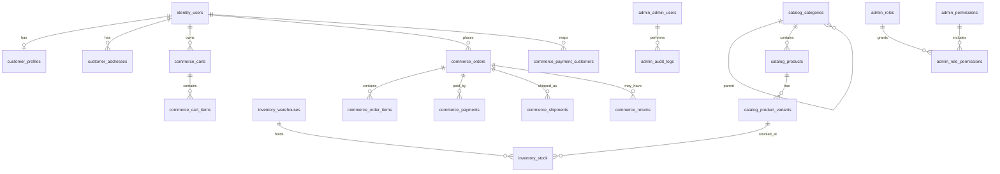
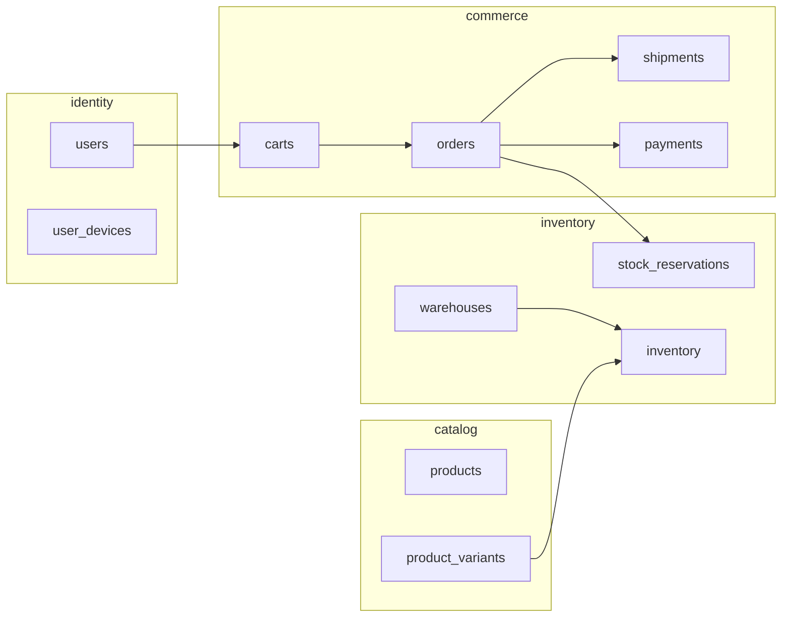

# Chic A Boo — Enterprise E-Commerce Database Architecture

**Version:** 2.0  
**Status:** Design specification for senior backend implementation  
**Database:** PostgreSQL 15 (Supabase)  
**Audience:** Backend engineers, DBAs, security, analytics  

---

## Executive Summary

This document defines the **complete** production database for Chic A Boo — an enterprise-grade e-commerce platform targeting 100,000+ users, 50,000+ products, and millions of orders. It extends the implemented v1.1 foundation (`identity`, `public`, `admin` schemas, migrations `000001`–`000010`) into a full commerce data model designed for:

- Multi-warehouse inventory with auditable stock movements
- Razorpay payments with webhook idempotency
- Guest and authenticated carts, multi-wishlist support
- Returns, refunds, shipping, coupons, reviews, notifications
- Unified audit trail and analytics event store
- Future marketplace (multi-vendor), mobile apps, and ERP integration

**No application code** — schema, constraints, indexes, RLS, and operational strategy only.

---

## 1. Recommended Schema Layout

Supabase reserves the `auth` schema. Chic A Boo uses **`identity`** for authentication tables.

| Schema | Bounded context | RLS | Service owners |
|--------|-----------------|-----|----------------|
| `identity` | Authentication, devices, security | Customer tables ON | UserService |
| `customer` | Profiles, addresses, preferences | ON | UserService |
| `catalog` | Categories, products, attributes, tags | SELECT public; writes service | Backend, Admin |
| `inventory` | Warehouses, stock, movements, reservations | OFF (service role) | Backend, Admin |
| `commerce` | Cart, wishlist, orders, payments, coupons, shipping, returns | Mixed | Backend, Admin |
| `platform` | Notifications, webhooks, analytics, unified audit | Mixed | All services |
| `admin` | RBAC, admin users, admin sessions | OFF | Admin |

**Rationale:** Seven schemas map to team ownership and future service extraction without a redesign. Catalog and inventory are isolated for ERP sync jobs. `commerce` holds transactional data with strict consistency requirements. `platform` holds cross-cutting append-only logs.

**Alternative (simpler):** Collapse `customer` → `public`, `catalog` + `inventory` + `commerce` → `public`. Acceptable below 10M rows per table; migrate to bounded schemas when ERP or marketplace launches.

This spec uses **bounded schemas** as the target layout.

---

## 2. Entity Relationship Design (ERD)

### 2.1 High-level domain map



### 2.2 Core commerce flow



---

## 3. Global Conventions

### 3.1 Column standards (every user-facing / business table)

| Column | Type | Rule |
|--------|------|------|
| `id` | UUID PK | `DEFAULT gen_random_uuid()` |
| `created_at` | TIMESTAMPTZ | `NOT NULL DEFAULT now()` |
| `updated_at` | TIMESTAMPTZ | Trigger-maintained where mutable |
| `deleted_at` | TIMESTAMPTZ | Soft delete where specified |
| `metadata` | JSONB | `DEFAULT '{}'` for extensibility |
| `external_id` | TEXT NULL | ERP / marketplace sync key |
| `sync_status` | TEXT NULL | `pending`, `synced`, `failed` (ERP readiness) |
| `last_synced_at` | TIMESTAMPTZ NULL | ERP readiness |

### 3.2 Human-readable numbers

| Entity | Column | Sequence start | Display |
|--------|--------|----------------|---------|
| Customer | `customer_number` | 100001 | Customer #100001 |
| Order | `order_number` | 1000001 | Order #1000001 |
| Return | `return_number` | 500001 | Return #500001 |
| Shipment | `shipment_number` | 700001 | Shipment #700001 |

Use `BIGINT` + dedicated sequence per entity. UUID remains the join key everywhere.

### 3.3 CHECK constraint pattern (no ENUM types)

```sql
-- Example pattern (documentation only)
status TEXT NOT NULL DEFAULT 'draft'
  CONSTRAINT ... CHECK (status IN ('draft', 'active', 'archived'))
```

### 3.4 Redis vs PostgreSQL ownership

| Data | Owner | DB role |
|------|-------|---------|
| Refresh tokens (active) | Redis | `identity.refresh_tokens` stores JTI hash for rotation audit |
| OTP codes | Redis | `identity.email_verifications` stores hash + attempts backup |
| Rate limits | Redis | — |
| Token blacklist (hot) | Redis | `identity.blocked_tokens` persistent backup |
| Cart (active session) | Redis | `commerce.carts` DB persistence on checkout / periodic sync |
| Product cache | Redis | — |

---

## 4. Module Specifications

---

### MODULE 1 — AUTH (`identity` schema)

**Implemented (v1.1):** `users`, `refresh_tokens`, `email_otps`, `password_resets`, `security_logs`, `user_devices`, `login_history`

#### 4.1.1 `identity.users`

| Column | Type | Constraints |
|--------|------|-------------|
| `id` | UUID | PK |
| `customer_number` | BIGINT | UNIQUE, NOT NULL, seq |
| `email` | TEXT | NOT NULL |
| `email_normalized` | TEXT | NOT NULL; UNIQUE WHERE `deleted_at IS NULL` |
| `phone` | TEXT | NULL; UNIQUE WHERE verified + active |
| `password_hash` | TEXT | NOT NULL (Argon2id) |
| `email_verified` | BOOLEAN | DEFAULT FALSE |
| `phone_verified` | BOOLEAN | DEFAULT FALSE |
| `status` | TEXT | `active`, `suspended`, `blocked`, `pending_verification` |
| `status_reason` | TEXT | NULL |
| `failed_login_attempts` | INTEGER | DEFAULT 0, CHECK ≥ 0 |
| `locked_until` | TIMESTAMPTZ | NULL |
| `last_login_at` | TIMESTAMPTZ | NULL |
| `created_at`, `updated_at`, `deleted_at` | TIMESTAMPTZ | standard |

**Indexes:** `email_normalized` (partial unique), `customer_number` (unique), `phone` (partial), `status`, `created_at`, `locked_until` (partial)

**RLS:** SELECT/UPDATE own row via `app.current_user_id`

#### 4.1.2 `identity.refresh_tokens`

| Column | Type | Notes |
|--------|------|-------|
| `id` | UUID | PK |
| `user_id` | UUID | FK → `identity.users` |
| `device_id` | UUID | FK → `identity.user_devices` NULL |
| `token_jti` | TEXT | UNIQUE; never plaintext token |
| `expires_at` | TIMESTAMPTZ | |
| `revoked` | BOOLEAN | DEFAULT FALSE |
| `revoked_at` | TIMESTAMPTZ | NULL |
| `created_at` | TIMESTAMPTZ | |

**Indexes:** `token_jti` (unique), `user_id`, `expires_at`, `(user_id, revoked)` partial active

**RLS:** OFF — service only

#### 4.1.3 `identity.email_verifications`

Rename from `email_otps` in migration; same structure:

| Column | Type |
|--------|------|
| `id` | UUID PK |
| `email` | TEXT NOT NULL |
| `email_normalized` | TEXT NOT NULL |
| `otp_hash` | TEXT NOT NULL |
| `purpose` | TEXT | `registration`, `email_change`, `login` |
| `attempts` | INTEGER DEFAULT 0 |
| `max_attempts` | INTEGER DEFAULT 3 |
| `expires_at` | TIMESTAMPTZ |
| `verified` | BOOLEAN DEFAULT FALSE |
| `verified_at` | TIMESTAMPTZ NULL |
| `created_at` | TIMESTAMPTZ |

**Indexes:** `email_normalized`, `expires_at`, `(email_normalized, purpose)` WHERE NOT verified

#### 4.1.4 `identity.password_resets`

| Column | Type |
|--------|------|
| `id` | UUID PK |
| `user_id` | UUID FK |
| `token_hash` | TEXT UNIQUE |
| `expires_at` | TIMESTAMPTZ |
| `used` | BOOLEAN DEFAULT FALSE |
| `used_at` | TIMESTAMPTZ NULL |
| `ip_address` | TEXT |
| `created_at` | TIMESTAMPTZ |

#### 4.1.5 `identity.user_devices`

Implemented. Add: `fingerprint_hash` TEXT (device dedup), `push_token` TEXT NULL (mobile readiness)

#### 4.1.6 `identity.login_history`

Implemented. Append-only.

#### 4.1.7 `identity.security_logs`

Implemented. Append-only. `event_type` unconstrained TEXT for forward compatibility.

#### 4.1.8 `identity.blocked_tokens` *(new)*

Persistent JWT blacklist beyond Redis TTL.

| Column | Type |
|--------|------|
| `id` | UUID PK |
| `jti` | TEXT UNIQUE NOT NULL |
| `user_id` | UUID FK NULL |
| `token_type` | TEXT | `access`, `refresh` |
| `reason` | TEXT | `logout`, `password_change`, `admin_revoke`, `compromise` |
| `expires_at` | TIMESTAMPTZ | Auto-purge eligible rows |
| `created_at` | TIMESTAMPTZ |

**Indexes:** `jti` (unique), `expires_at` (for cleanup job)

**RLS:** OFF

---

### MODULE 2 — CUSTOMER (`customer` schema)

Migrate existing `public.user_*` tables to `customer` schema in Phase 2 migration.

#### 4.2.1 `customer.profiles`

| Column | Type |
|--------|------|
| `id` | UUID PK |
| `user_id` | UUID UNIQUE FK → `identity.users` |
| `first_name`, `last_name` | TEXT |
| `gender` | TEXT NULL |
| `date_of_birth` | DATE NULL |
| `avatar_url` | TEXT NULL (R2 path) |
| `loyalty_tier` | TEXT | `bronze`, `silver`, `gold`, `platinum` |
| `loyalty_points` | INTEGER DEFAULT 0, CHECK ≥ 0 |
| `referral_code` | TEXT UNIQUE NULL |
| `referred_by_user_id` | UUID FK NULL |
| `metadata` | JSONB |
| `created_at`, `updated_at`, `deleted_at` | TIMESTAMPTZ |

**Indexes:** `user_id` (unique partial), `loyalty_tier`, `referral_code` (unique partial), `last_name`, `first_name`

**RLS:** full own-row policies

#### 4.2.2 `customer.addresses`

| Column | Type |
|--------|------|
| `id` | UUID PK |
| `user_id` | UUID FK |
| `address_type` | TEXT | `shipping`, `billing`, `home`, `office`, `other` |
| `custom_label` | TEXT NULL |
| `label` | TEXT NULL |
| `full_name`, `phone` | TEXT |
| `line1`, `line2`, `landmark` | TEXT |
| `city`, `state`, `postal_code`, `country` | TEXT |
| `is_default_shipping` | BOOLEAN DEFAULT FALSE |
| `is_default_billing` | BOOLEAN DEFAULT FALSE |
| `latitude`, `longitude` | NUMERIC NULL |
| `metadata` | JSONB |
| `created_at`, `updated_at`, `deleted_at` | TIMESTAMPTZ |

**Indexes:** `user_id`, `postal_code`, `(user_id, address_type)` partial, partial unique on `(user_id)` WHERE `is_default_shipping` AND NOT deleted (one default per type)

**RLS:** ON

#### 4.2.3 `customer.preferences`

| Column | Type |
|--------|------|
| `id` | UUID PK |
| `user_id` | UUID UNIQUE FK |
| `preferred_language` | TEXT DEFAULT `en` |
| `currency` | TEXT DEFAULT `INR` |
| `timezone` | TEXT DEFAULT `Asia/Kolkata` |
| `metadata` | JSONB |
| `created_at`, `updated_at` | TIMESTAMPTZ |

#### 4.2.4 `customer.communication_preferences` *(new)*

| Column | Type |
|--------|------|
| `id` | UUID PK |
| `user_id` | UUID UNIQUE FK |
| `email_marketing` | BOOLEAN DEFAULT FALSE |
| `sms_marketing` | BOOLEAN DEFAULT FALSE |
| `push_notifications` | BOOLEAN DEFAULT TRUE |
| `order_updates_email` | BOOLEAN DEFAULT TRUE |
| `order_updates_sms` | BOOLEAN DEFAULT FALSE |
| `promotional_push` | BOOLEAN DEFAULT FALSE |
| `metadata` | JSONB |
| `created_at`, `updated_at` | TIMESTAMPTZ |

**RLS:** ON

---

### MODULE 3 — ADMIN (`admin` schema)

**Implemented:** `admin_users`, `roles`, `permissions`, `role_permissions`, `audit_logs`, `admin_sessions`

#### 4.3.1 `admin.admin_users`

Implemented + MFA columns. Add: `last_login_at`, `password_changed_at`, `must_change_password` BOOLEAN

#### 4.3.2 `admin.roles` / `admin.permissions` / `admin.role_permissions`

Implemented. Permission naming: `{resource}.{action}` (`read`, `write`, `delete`, `refund`)

#### 4.3.3 `admin.admin_sessions`

Implemented. Append-only revocation via `revoked_at`.

#### 4.3.4 `admin.audit_logs`

Implemented + `request_id`, `user_agent`, `target_user_id`. Rename conceptually to **admin_audit_logs**; keep table name for compatibility.

Add: `service_name` TEXT (`admin`, `backend`, `userservice`), `correlation_id` TEXT

**Append-only.** No UPDATE/DELETE grants.

---

### MODULE 4 — CATEGORY (`catalog` schema)

#### 4.4.1 `catalog.categories`

| Column | Type |
|--------|------|
| `id` | UUID PK |
| `parent_id` | UUID FK → self NULL |
| `name` | TEXT NOT NULL |
| `slug` | TEXT NOT NULL |
| `description` | TEXT |
| `image_url` | TEXT NULL (R2) |
| `sort_order` | INTEGER DEFAULT 0 |
| `status` | TEXT | `active`, `inactive`, `archived` |
| `path` | TEXT | Materialized path e.g. `/women/ethnic/sarees` |
| `depth` | INTEGER DEFAULT 0 |
| `seo_title` | TEXT |
| `seo_description` | TEXT |
| `seo_keywords` | TEXT |
| `metadata` | JSONB |
| `created_at`, `updated_at`, `deleted_at` | TIMESTAMPTZ |

**Indexes:**
- `slug` UNIQUE WHERE `deleted_at IS NULL`
- `parent_id`
- `status` partial active
- `path` (prefix search)
- `search_vector` GIN (see §10)

**Nesting:** Unlimited via `parent_id` + `path`/`depth` for efficient subtree queries. Alternative: `ltree` extension — optional Phase 3.

**RLS:** SELECT for `status = 'active'` (anonymous catalog browse); writes service-only

---

### MODULE 5 — PRODUCT CATALOG (`catalog` schema)

#### 4.5.1 `catalog.products`

| Column | Type |
|--------|------|
| `id` | UUID PK |
| `vendor_id` | UUID NULL FK → future `catalog.vendors` |
| `category_id` | UUID FK → `catalog.categories` |
| `name` | TEXT NOT NULL |
| `slug` | TEXT NOT NULL |
| `description` | TEXT |
| `short_description` | TEXT |
| `brand` | TEXT |
| `status` | TEXT | `draft`, `active`, `inactive`, `archived` |
| `is_featured` | BOOLEAN DEFAULT FALSE |
| `featured_sort_order` | INTEGER NULL |
| `base_price` | NUMERIC(12,2) | Display/reference; variant may override |
| `compare_at_price` | NUMERIC(12,2) NULL |
| `tax_class` | TEXT | `standard`, `reduced`, `zero` |
| `hsn_code` | TEXT NULL (India GST) |
| `search_vector` | TSVECTOR | Generated/stored |
| `seo_title`, `seo_description` | TEXT |
| `published_at` | TIMESTAMPTZ NULL |
| `metadata` | JSONB |
| `external_id`, `sync_status`, `last_synced_at` | ERP fields |
| `created_at`, `updated_at`, `deleted_at` | TIMESTAMPTZ |

**Indexes:**
- `slug` UNIQUE partial
- `category_id`
- `status` partial active
- `is_featured` partial WHERE TRUE
- `search_vector` GIN
- `name` GIN `gin_trgm_ops` (pg_trgm)
- `brand`
- `(vendor_id)` partial NULL for marketplace

#### 4.5.2 `catalog.product_variants`

| Column | Type |
|--------|------|
| `id` | UUID PK |
| `product_id` | UUID FK |
| `sku` | TEXT NOT NULL |
| `barcode` | TEXT NULL |
| `title` | TEXT | e.g. "Red / M" |
| `option_values` | JSONB | `{"color":"Red","size":"M"}` |
| `price` | NUMERIC(12,2) |
| `compare_at_price` | NUMERIC(12,2) NULL |
| `cost_price` | NUMERIC(12,2) NULL |
| `weight_grams` | INTEGER NULL |
| `status` | TEXT | `active`, `inactive` |
| `metadata` | JSONB |
| `created_at`, `updated_at`, `deleted_at` | TIMESTAMPTZ |

**Indexes:**
- `sku` UNIQUE partial
- `barcode` UNIQUE partial WHERE NOT NULL
- `product_id`
- `sku` GIN trgm

#### 4.5.3 `catalog.product_images`

| Column | Type |
|--------|------|
| `id` | UUID PK |
| `product_id` | UUID FK |
| `variant_id` | UUID FK NULL |
| `url` | TEXT (R2 key or CDN URL) |
| `alt_text` | TEXT |
| `sort_order` | INTEGER DEFAULT 0 |
| `is_primary` | BOOLEAN DEFAULT FALSE |
| `created_at`, `deleted_at` | TIMESTAMPTZ |

**Indexes:** `product_id`, `(product_id, sort_order)`, partial unique one primary per product

#### 4.5.4 `catalog.attributes` / `catalog.attribute_values`

| Column (attributes) | Type |
| `id` | UUID PK |
| `name` | TEXT UNIQUE | e.g. `Color`, `Size` |
| `code` | TEXT UNIQUE | e.g. `color`, `size` |
| `sort_order` | INTEGER |

| Column (attribute_values) | Type |
| `id` | UUID PK |
| `attribute_id` | UUID FK |
| `value` | TEXT | e.g. `Red` |
| `sort_order` | INTEGER |

**Unique:** `(attribute_id, value)`

#### 4.5.5 `catalog.product_attribute_values`

| Column | Type |
| `product_id` | UUID FK |
| `attribute_id` | UUID FK |
| `attribute_value_id` | UUID FK |

**PK:** `(product_id, attribute_id, attribute_value_id)`

#### 4.5.6 `catalog.product_tags` / `catalog.product_tag_mappings`

**tags:** `id`, `name` UNIQUE, `slug` UNIQUE  
**mappings:** `product_id`, `tag_id` — UNIQUE pair

---

### MODULE 6 — INVENTORY (`inventory` schema)

#### 4.6.1 `inventory.warehouses`

| Column | Type |
|--------|------|
| `id` | UUID PK |
| `code` | TEXT UNIQUE | e.g. `WH-MUM-01` |
| `name` | TEXT |
| `address` | JSONB | structured address |
| `is_active` | BOOLEAN DEFAULT TRUE |
| `is_default` | BOOLEAN DEFAULT FALSE |
| `priority` | INTEGER DEFAULT 0 | fulfillment priority |
| `metadata` | JSONB |
| `external_id`, `sync_status`, `last_synced_at` | ERP |
| `created_at`, `updated_at`, `deleted_at` | TIMESTAMPTZ |

#### 4.6.2 `inventory.stock`

| Column | Type |
|--------|------|
| `id` | UUID PK |
| `warehouse_id` | UUID FK |
| `variant_id` | UUID FK → `catalog.product_variants` |
| `quantity_on_hand` | INTEGER NOT NULL DEFAULT 0 |
| `quantity_reserved` | INTEGER NOT NULL DEFAULT 0 |
| `quantity_available` | INTEGER GENERATED ALWAYS AS (`quantity_on_hand - quantity_reserved`) STORED |
| `low_stock_threshold` | INTEGER DEFAULT 5 |
| `metadata` | JSONB |
| `updated_at` | TIMESTAMPTZ |

**Unique:** `(warehouse_id, variant_id)`  
**Indexes:** `variant_id`, `quantity_available` partial low stock  
**CHECK:** `quantity_on_hand >= 0`, `quantity_reserved >= 0`, `quantity_reserved <= quantity_on_hand`

**RLS:** OFF

#### 4.6.3 `inventory.movements` *(auditable history)*

| Column | Type |
|--------|------|
| `id` | UUID PK |
| `warehouse_id` | UUID FK |
| `variant_id` | UUID FK |
| `movement_type` | TEXT | `purchase`, `sale`, `return`, `adjustment`, `transfer_in`, `transfer_out`, `reservation`, `release` |
| `quantity_delta` | INTEGER | signed |
| `quantity_before` | INTEGER |
| `quantity_after` | INTEGER |
| `reference_type` | TEXT | `order`, `return`, `transfer`, `manual` |
| `reference_id` | UUID NULL |
| `reason` | TEXT |
| `admin_id` | UUID FK NULL |
| `metadata` | JSONB |
| `created_at` | TIMESTAMPTZ |

**Append-only.** **Indexes:** `(variant_id, created_at DESC)`, `warehouse_id`, `(reference_type, reference_id)`, `movement_type`, `created_at`

#### 4.6.4 `inventory.stock_reservations`

| Column | Type |
|--------|------|
| `id` | UUID PK |
| `warehouse_id` | UUID FK |
| `variant_id` | UUID FK |
| `order_id` | UUID FK NULL → `commerce.orders` |
| `cart_id` | UUID FK NULL |
| `quantity` | INTEGER CHECK > 0 |
| `status` | TEXT | `active`, `committed`, `released`, `expired` |
| `expires_at` | TIMESTAMPTZ |
| `created_at`, `updated_at` | TIMESTAMPTZ |

**Indexes:** `(variant_id, status)` partial active, `expires_at`, `order_id`, `cart_id`

---

### MODULE 7 — CART (`commerce` schema)

#### 4.7.1 `commerce.carts`

| Column | Type |
|--------|------|
| `id` | UUID PK |
| `user_id` | UUID FK NULL |
| `guest_token` | TEXT UNIQUE NULL | hashed guest identifier |
| `status` | TEXT | `active`, `merged`, `converted`, `abandoned`, `expired` |
| `currency` | TEXT DEFAULT `INR` |
| `coupon_id` | UUID FK NULL |
| `subtotal` | NUMERIC(12,2) DEFAULT 0 |
| `discount_total` | NUMERIC(12,2) DEFAULT 0 |
| `expires_at` | TIMESTAMPTZ |
| `converted_order_id` | UUID NULL |
| `metadata` | JSONB |
| `created_at`, `updated_at`, `deleted_at` | TIMESTAMPTZ |

**CHECK:** `user_id IS NOT NULL OR guest_token IS NOT NULL`  
**Indexes:** `user_id` partial active, `guest_token` partial, `expires_at`, `status`

**RLS:** ON for `user_id` match; guest carts via service token

#### 4.7.2 `commerce.cart_items`

| Column | Type |
|--------|------|
| `id` | UUID PK |
| `cart_id` | UUID FK |
| `variant_id` | UUID FK |
| `quantity` | INTEGER CHECK > 0 |
| `unit_price` | NUMERIC(12,2) | price snapshot |
| `metadata` | JSONB |
| `created_at`, `updated_at`, `deleted_at` | TIMESTAMPTZ |

**Unique:** `(cart_id, variant_id)` WHERE NOT deleted  
**Indexes:** `cart_id`, `variant_id`

---

### MODULE 8 — WISHLIST (`commerce` schema)

#### 4.8.1 `commerce.wishlists`

| Column | Type |
| `id` | UUID PK |
| `user_id` | UUID FK |
| `name` | TEXT DEFAULT `My Wishlist` |
| `is_default` | BOOLEAN DEFAULT FALSE |
| `is_public` | BOOLEAN DEFAULT FALSE |
| `share_token` | TEXT UNIQUE NULL |
| `created_at`, `updated_at`, `deleted_at` | TIMESTAMPTZ |

**Indexes:** `user_id`, partial unique default per user

#### 4.8.2 `commerce.wishlist_items`

| Column | Type |
| `id` | UUID PK |
| `wishlist_id` | UUID FK |
| `product_id` | UUID FK |
| `variant_id` | UUID FK NULL |
| `note` | TEXT NULL |
| `created_at` | TIMESTAMPTZ |

**Unique:** `(wishlist_id, product_id, variant_id)`

**RLS:** ON — own wishlists

---

### MODULE 9 — ORDER MANAGEMENT (`commerce` schema)

#### 4.9.1 `commerce.orders`

| Column | Type |
|--------|------|
| `id` | UUID PK |
| `order_number` | BIGINT UNIQUE seq |
| `user_id` | UUID FK NULL (guest checkout) |
| `guest_email` | TEXT NULL |
| `status` | TEXT | see lifecycle below |
| `payment_status` | TEXT | `pending`, `authorized`, `paid`, `partially_refunded`, `refunded`, `failed` |
| `fulfillment_status` | TEXT | `unfulfilled`, `partial`, `fulfilled`, `cancelled` |
| `currency` | TEXT DEFAULT `INR` |
| `subtotal` | NUMERIC(12,2) |
| `discount_total` | NUMERIC(12,2) DEFAULT 0 |
| `tax_total` | NUMERIC(12,2) DEFAULT 0 |
| `shipping_total` | NUMERIC(12,2) DEFAULT 0 |
| `grand_total` | NUMERIC(12,2) |
| `coupon_id` | UUID FK NULL |
| `coupon_code` | TEXT NULL snapshot |
| `shipping_address` | JSONB | snapshot at order time |
| `billing_address` | JSONB | snapshot |
| `customer_note` | TEXT |
| `admin_note` | TEXT |
| `cancelled_at` | TIMESTAMPTZ NULL |
| `cancellation_reason` | TEXT |
| `metadata` | JSONB |
| `created_at`, `updated_at`, `deleted_at` | TIMESTAMPTZ |

**Order status lifecycle:**  
`pending` → `confirmed` → `processing` → `shipped` → `delivered` → `completed`  
Branches: `cancelled`, `returned`, `refunded`

**Indexes:**
- `order_number` (unique)
- `user_id`, `created_at DESC`
- `status`, `payment_status`
- `guest_email` partial
- `(created_at)` for reporting

**RLS:** SELECT own orders via `user_id`

#### 4.9.2 `commerce.order_items`

| Column | Type |
| `id` | UUID PK |
| `order_id` | UUID FK |
| `variant_id` | UUID FK |
| `product_id` | UUID FK | denormalized |
| `sku` | TEXT | snapshot |
| `product_name` | TEXT | snapshot |
| `variant_title` | TEXT | snapshot |
| `quantity` | INTEGER |
| `unit_price` | NUMERIC(12,2) |
| `discount_amount` | NUMERIC(12,2) DEFAULT 0 |
| `tax_amount` | NUMERIC(12,2) DEFAULT 0 |
| `line_total` | NUMERIC(12,2) |
| `metadata` | JSONB |
| `created_at` | TIMESTAMPTZ |

**Indexes:** `order_id`, `variant_id`, `product_id`

#### 4.9.3 `commerce.order_status_history`

| Column | Type |
| `id` | UUID PK |
| `order_id` | UUID FK |
| `from_status` | TEXT NULL |
| `to_status` | TEXT |
| `changed_by_type` | TEXT | `system`, `customer`, `admin` |
| `changed_by_id` | UUID NULL |
| `reason` | TEXT |
| `metadata` | JSONB |
| `created_at` | TIMESTAMPTZ |

**Append-only.** **Indexes:** `(order_id, created_at DESC)`

---

### MODULE 10 — PAYMENT (`commerce` schema)

#### 4.10.1 `commerce.payment_customers`

Implemented in `public` — migrate to `commerce` schema. Structure unchanged.

#### 4.10.2 `commerce.payments`

| Column | Type |
|--------|------|
| `id` | UUID PK |
| `order_id` | UUID FK UNIQUE per attempt group |
| `user_id` | UUID FK NULL |
| `provider` | TEXT | `razorpay` |
| `provider_payment_id` | TEXT UNIQUE NULL |
| `provider_order_id` | TEXT NULL |
| `amount` | NUMERIC(12,2) |
| `currency` | TEXT |
| `status` | TEXT | `created`, `authorized`, `captured`, `failed`, `refunded` |
| `method` | TEXT NULL | `upi`, `card`, `netbanking`, `wallet` |
| `failure_reason` | TEXT |
| `metadata` | JSONB |
| `created_at`, `updated_at` | TIMESTAMPTZ |

**Indexes:** `order_id`, `provider_payment_id` (unique partial), `status`, `created_at`

#### 4.10.3 `commerce.payment_transactions`

| Column | Type |
| `id` | UUID PK |
| `payment_id` | UUID FK |
| `transaction_type` | TEXT | `authorization`, `capture`, `refund`, `void` |
| `provider_transaction_id` | TEXT UNIQUE NULL |
| `amount` | NUMERIC(12,2) |
| `status` | TEXT |
| `raw_payload` | JSONB | webhook snapshot |
| `created_at` | TIMESTAMPTZ |

**Append-only ledger. Indexes:** `payment_id`, `provider_transaction_id`, `created_at`

#### 4.10.4 `commerce.refunds`

| Column | Type |
| `id` | UUID PK |
| `payment_id` | UUID FK |
| `order_id` | UUID FK |
| `return_id` | UUID FK NULL |
| `provider_refund_id` | TEXT UNIQUE NULL |
| `amount` | NUMERIC(12,2) |
| `status` | TEXT | `pending`, `processed`, `failed` |
| `reason` | TEXT |
| `initiated_by_admin_id` | UUID NULL |
| `metadata` | JSONB |
| `created_at`, `updated_at` | TIMESTAMPTZ |

---

### MODULE 11 — COUPON (`commerce` schema)

#### 4.11.1 `commerce.coupons`

| Column | Type |
| `id` | UUID PK |
| `code` | TEXT NOT NULL |
| `code_normalized` | TEXT NOT NULL |
| `description` | TEXT |
| `discount_type` | TEXT | `percentage`, `fixed_amount`, `free_shipping` |
| `discount_value` | NUMERIC(12,2) |
| `max_discount_amount` | NUMERIC(12,2) NULL |
| `min_order_amount` | NUMERIC(12,2) NULL |
| `usage_limit_total` | INTEGER NULL |
| `usage_limit_per_user` | INTEGER DEFAULT 1 |
| `usage_count` | INTEGER DEFAULT 0 |
| `starts_at` | TIMESTAMPTZ |
| `expires_at` | TIMESTAMPTZ NULL |
| `status` | TEXT | `active`, `inactive`, `expired` |
| `applies_to` | TEXT | `all`, `category`, `product`, `customer` |
| `target_ids` | UUID[] NULL |
| `target_user_id` | UUID NULL | customer-specific |
| `metadata` | JSONB |
| `created_at`, `updated_at`, `deleted_at` | TIMESTAMPTZ |

**Indexes:** `code_normalized` UNIQUE partial, `status`, `expires_at`, `target_user_id` partial

#### 4.11.2 `commerce.coupon_usages`

| Column | Type |
| `id` | UUID PK |
| `coupon_id` | UUID FK |
| `user_id` | UUID FK NULL |
| `order_id` | UUID FK |
| `discount_applied` | NUMERIC(12,2) |
| `created_at` | TIMESTAMPTZ |

**Unique:** `(coupon_id, order_id)`  
**Indexes:** `user_id`, `coupon_id`

---

### MODULE 12 — SHIPPING (`commerce` schema)

#### 4.12.1 `commerce.shipments`

| Column | Type |
| `id` | UUID PK |
| `shipment_number` | BIGINT UNIQUE seq |
| `order_id` | UUID FK |
| `warehouse_id` | UUID FK NULL |
| `status` | TEXT | `pending`, `packed`, `shipped`, `in_transit`, `delivered`, `failed`, `returned` |
| `courier_code` | TEXT NULL |
| `courier_name` | TEXT NULL |
| `tracking_number` | TEXT NULL |
| `tracking_url` | TEXT NULL |
| `shipped_at`, `delivered_at` | TIMESTAMPTZ NULL |
| `metadata` | JSONB |
| `created_at`, `updated_at`, `deleted_at` | TIMESTAMPTZ |

**Indexes:** `order_id`, `tracking_number`, `status`, `shipment_number`

#### 4.12.2 `commerce.shipment_tracking_events`

| Column | Type |
| `id` | UUID PK |
| `shipment_id` | UUID FK |
| `status` | TEXT |
| `description` | TEXT |
| `location` | TEXT |
| `event_at` | TIMESTAMPTZ |
| `raw_payload` | JSONB |
| `created_at` | TIMESTAMPTZ |

**Append-only. Indexes:** `(shipment_id, event_at DESC)`

---

### MODULE 13 — RETURNS & REFUNDS (`commerce` schema)

#### 4.13.1 `commerce.returns`

| Column | Type |
| `id` | UUID PK |
| `return_number` | BIGINT UNIQUE seq |
| `order_id` | UUID FK |
| `user_id` | UUID FK |
| `status` | TEXT | `requested`, `approved`, `rejected`, `received`, `refunded`, `closed` |
| `reason` | TEXT |
| `customer_note` | TEXT |
| `admin_note` | TEXT |
| `refund_amount` | NUMERIC(12,2) NULL |
| `metadata` | JSONB |
| `created_at`, `updated_at`, `deleted_at` | TIMESTAMPTZ |

#### 4.13.2 `commerce.return_items`

| Column | Type |
| `id` | UUID PK |
| `return_id` | UUID FK |
| `order_item_id` | UUID FK |
| `quantity` | INTEGER CHECK > 0 |
| `condition` | TEXT | `unopened`, `opened`, `damaged` |
| `refund_amount` | NUMERIC(12,2) |
| `restock` | BOOLEAN DEFAULT TRUE |
| `created_at` | TIMESTAMPTZ |

**Supports partial returns** via quantity < order item quantity.

---

### MODULE 14 — REVIEWS (`commerce` schema)

#### 4.14.1 `commerce.reviews`

| Column | Type |
| `id` | UUID PK |
| `product_id` | UUID FK |
| `variant_id` | UUID FK NULL |
| `user_id` | UUID FK |
| `order_id` | UUID FK NULL |
| `rating` | INTEGER CHECK 1–5 |
| `title` | TEXT |
| `body` | TEXT |
| `is_verified_purchase` | BOOLEAN DEFAULT FALSE |
| `status` | TEXT | `pending`, `approved`, `rejected`, `hidden` |
| `moderated_by_admin_id` | UUID NULL |
| `moderated_at` | TIMESTAMPTZ NULL |
| `helpful_count` | INTEGER DEFAULT 0 |
| `metadata` | JSONB |
| `created_at`, `updated_at`, `deleted_at` | TIMESTAMPTZ |

**Unique:** `(user_id, product_id, order_id)` partial — one review per purchase  
**Indexes:** `product_id`, `status` partial approved, `rating`, `created_at DESC`

**RLS:** SELECT approved reviews public; INSERT/UPDATE own pending

#### 4.14.2 `commerce.review_images`

| Column | Type |
| `id` | UUID PK |
| `review_id` | UUID FK |
| `url` | TEXT |
| `sort_order` | INTEGER |
| `created_at`, `deleted_at` | TIMESTAMPTZ |

---

### MODULE 15 — NOTIFICATIONS (`platform` schema)

#### 4.15.1 `platform.notifications`

| Column | Type |
| `id` | UUID PK |
| `user_id` | UUID FK NULL |
| `channel` | TEXT | `email`, `sms`, `push`, `in_app` |
| `category` | TEXT | `order`, `marketing`, `security`, `system` |
| `title` | TEXT |
| `body` | TEXT |
| `payload` | JSONB |
| `status` | TEXT | `pending`, `sent`, `delivered`, `failed`, `read` |
| `read_at` | TIMESTAMPTZ NULL |
| `scheduled_at` | TIMESTAMPTZ NULL |
| `sent_at` | TIMESTAMPTZ NULL |
| `created_at`, `updated_at` | TIMESTAMPTZ |

**Indexes:** `(user_id, created_at DESC)`, `status` partial pending, `channel`

**RLS:** SELECT/UPDATE own in_app notifications

#### 4.15.2 `platform.notification_logs`

| Column | Type |
| `id` | UUID PK |
| `notification_id` | UUID FK |
| `provider` | TEXT | `resend`, `twilio`, `fcm` |
| `provider_message_id` | TEXT |
| `event_type` | TEXT | `sent`, `delivered`, `bounced`, `failed`, `opened` |
| `raw_payload` | JSONB |
| `created_at` | TIMESTAMPTZ |

**Append-only.**

---

### MODULE 16 — ANALYTICS (`platform` schema)

#### 4.16.1 `platform.user_events`

| Column | Type |
| `id` | UUID PK |
| `user_id` | UUID FK NULL |
| `session_id` | TEXT |
| `event_name` | TEXT | `page_view`, `product_viewed`, `add_to_cart`, `checkout_started`, `order_completed` |
| `properties` | JSONB |
| `page_url` | TEXT |
| `referrer` | TEXT |
| `device_type` | TEXT |
| `ip_address` | TEXT |
| `user_agent` | TEXT |
| `created_at` | TIMESTAMPTZ |

**Indexes:** `event_name`, `created_at`, `(user_id, created_at DESC)`, GIN on `properties` (optional)

**Note:** PostHog is primary real-time analytics; this table is the **warehouse-ready event store** for BI and backfill.

**Partitioning:** monthly RANGE on `created_at` (see §12)

---

### MODULE 17 — WEBHOOKS (`platform` schema)

#### 4.17.1 `platform.webhooks`

| Column | Type |
| `id` | UUID PK |
| `provider` | TEXT | `razorpay`, `shiprocket`, `erp` |
| `event_types` | TEXT[] |
| `endpoint_url` | TEXT NULL | outbound webhooks |
| `secret_hash` | TEXT |
| `is_active` | BOOLEAN |
| `metadata` | JSONB |
| `created_at`, `updated_at`, `deleted_at` | TIMESTAMPTZ |

#### 4.17.2 `platform.webhook_events`

| Column | Type |
| `id` | UUID PK |
| `provider` | TEXT |
| `provider_event_id` | TEXT NOT NULL |
| `event_type` | TEXT |
| `payload` | JSONB |
| `status` | TEXT | `received`, `processing`, `processed`, `failed` |
| `processed_at` | TIMESTAMPTZ NULL |
| `error_message` | TEXT |
| `retry_count` | INTEGER DEFAULT 0 |
| `created_at` | TIMESTAMPTZ |

**UNIQUE:** `(provider, provider_event_id)` — **idempotency**  
**Indexes:** `status` partial failed, `created_at`, `event_type`

---

### MODULE 18 — AUDIT (`platform` schema)

#### 4.18.1 `platform.audit_logs` *(unified)*

Cross-domain audit complementing `admin.audit_logs`.

| Column | Type |
| `id` | UUID PK |
| `actor_type` | TEXT | `user`, `admin`, `system` |
| `actor_id` | UUID NULL |
| `domain` | TEXT | `inventory`, `payment`, `order`, `catalog` |
| `entity_type` | TEXT |
| `entity_id` | UUID |
| `action` | TEXT |
| `old_data` | JSONB |
| `new_data` | JSONB |
| `ip_address` | TEXT |
| `user_agent` | TEXT |
| `request_id` | TEXT |
| `created_at` | TIMESTAMPTZ |

**Append-only. Indexes:** `(entity_type, entity_id)`, `actor_id`, `domain`, `created_at`, `request_id` partial

**Partitioning:** monthly on `created_at`

---

## 5. Index Strategy Summary

| Category | Tables | Pattern | Why |
|----------|--------|---------|-----|
| **PK** | All | UUID B-tree | Join performance |
| **FK** | All child tables | B-tree on FK column | JOIN / CASCADE speed |
| **Uniqueness** | slugs, SKUs, codes | Partial UNIQUE `WHERE deleted_at IS NULL` | Soft delete safe |
| **Human numbers** | order_number, etc. | UNIQUE B-tree | Support lookup |
| **Search** | products, categories | GIN `tsvector`, GIN `pg_trgm` | Full-text + fuzzy SKU |
| **Reporting** | orders, user_events | `(created_at DESC)`, composites | Time-range queries |
| **Status filters** | orders, payments | Partial indexes on active statuses | Smaller index size |
| **Idempotency** | webhook_events | UNIQUE `(provider, provider_event_id)` | Exactly-once processing |
| **Low stock** | inventory.stock | Partial `quantity_available <= threshold` | Admin alerts |

---

## 6. RLS Strategy

### 6.1 RLS ON (customer-scoped)

| Schema | Tables |
|--------|--------|
| `identity` | `users` |
| `customer` | `profiles`, `addresses`, `preferences`, `communication_preferences` |
| `commerce` | `carts`, `cart_items`, `wishlists`, `wishlist_items`, `orders`, `order_items`, `returns`, `reviews` (own), `payment_customers` (SELECT) |
| `platform` | `notifications` (in_app) |
| `catalog` | `categories` (SELECT active), `products` (SELECT active) |

**Mechanism:** `SET LOCAL app.current_user_id = '<uuid>'` per request transaction.

### 6.2 RLS OFF (service role only)

| Schema | Tables |
|--------|--------|
| `identity` | `refresh_tokens`, `email_verifications`, `password_resets`, `security_logs`, `login_history`, `blocked_tokens` |
| `inventory` | All tables |
| `commerce` | `payments`, `payment_transactions`, `refunds`, `shipments`, `coupons` |
| `platform` | `webhook_events`, `audit_logs`, `user_events`, `notification_logs` |
| `admin` | All tables |

**Rationale:** Writes to inventory, payments, and webhooks require elevated consistency and must never be triggered by customer JWT alone.

### 6.3 Catalog public read

Anonymous users browse active products via service-layer queries or RLS policy:

```sql
-- Conceptual policy
USING (status = 'active' AND deleted_at IS NULL)
```

---

## 7. Soft Delete Strategy

| Soft delete (`deleted_at`) | Hard delete allowed |
|---------------------------|---------------------|
| users, profiles, addresses | append-only logs after retention |
| products, variants, categories | `webhook_events` after 90d archive |
| orders (cancelled, not removed) | `login_history` after 90d |
| coupons, warehouses | `user_events` partition drop |
| reviews (moderation hide uses status) | `blocked_tokens` after `expires_at` |

**Never soft-delete:** `order_items`, `payment_transactions`, `inventory.movements`, `audit_logs`, `order_status_history` — use append-only.

---

## 8. Partitioning Strategy

| Table | Strategy | When |
|-------|----------|------|
| `platform.user_events` | RANGE monthly `created_at` | > 10M rows |
| `platform.audit_logs` | RANGE monthly `created_at` | > 5M rows |
| `commerce.payment_transactions` | RANGE monthly `created_at` | > 5M rows |
| `identity.login_history` | RANGE monthly | > 2M rows |
| `platform.notification_logs` | RANGE monthly | > 2M rows |

**Implementation:** Create parent table + monthly child partitions. Automate via `pg_partman` or scheduled migration job. Query always includes `created_at` range for partition pruning.

**Not partitioned at launch:** `orders` (UUID PK + `created_at` index sufficient to ~5M rows), `inventory.movements` (warehouse-scoped queries).

---

## 9. Search Strategy

### 9.1 Products

```sql
-- Stored generated column (conceptual)
search_vector = to_tsvector('english',
  coalesce(name,'') || ' ' || coalesce(brand,'') || ' ' || coalesce(description,''))
```

**Indexes:**
- `GIN (search_vector)` — full-text `@@` queries
- `GIN (name gin_trgm_ops)` — fuzzy autocomplete
- `GIN (sku gin_trgm_ops)` on `product_variants` — SKU/barcode search

### 9.2 Categories

- `GIN (name gin_trgm_ops)`
- `path` B-tree for prefix/subtree (`WHERE path LIKE '/women/%'`)

### 9.3 Query patterns

| Query | Engine |
|-------|--------|
| "red saree" | `search_vector @@ plainto_tsquery` |
| "SKU-1234" | `sku % 'SKU-1234'` or exact match |
| Autocomplete "sar" | `name ILIKE` replaced by `name % 'sar'` + `similarity()` |

**Redis cache:** `product:{slug}` TTL 10 min for PDP; invalidate on product update.

---

## 10. Audit Strategy

### 10.1 Three layers

| Layer | Store | Purpose |
|-------|-------|---------|
| Domain history | `order_status_history`, `inventory.movements`, `payment_transactions` | Business state replay |
| Admin audit | `admin.audit_logs` | Admin accountability |
| Unified audit | `platform.audit_logs` | Cross-domain compliance |

### 10.2 Mandatory audit events

- Admin: product create/update/delete, order status change, refund, role change, user ban
- System: payment capture, webhook processed, stock adjustment
- User: password change, email change (via `identity.security_logs`)

### 10.3 Implementation rule

Every admin mutation API **must** INSERT audit row in same transaction as business UPDATE.

---

## 11. Scalability Review

### 11.1 Targets

| Metric | Design support | Bottleneck | Mitigation |
|--------|----------------|------------|------------|
| 100k users | ✅ | `identity.users` email index | partial indexes, connection pooler |
| 50k products | ✅ | catalog search | GIN indexes, Redis cache, read replicas |
| 500k variants | ✅ | inventory joins | composite `(warehouse_id, variant_id)` |
| 1M+ orders | ✅ with partitioning path | `orders` table size | `created_at` indexes, partition by month at scale |
| 10M user_events | ⚠️ | insert throughput | monthly partitions, async batch insert |

### 11.2 Supabase-specific

- Use **transaction pooler** (port 6543) for FastAPI
- Use **read replica** (Pro plan) for analytics queries
- Avoid long transactions on checkout — stock reservation + order create < 500ms
- `pg_bouncer` incompatible with prepared statements — SQLAlchemy `statement_cache_size=0`

### 11.3 Future marketplace

- `catalog.products.vendor_id` nullable FK → `catalog.vendors`
- `catalog.vendors` table: `id`, `name`, `slug`, `commission_rate`, `status`
- Row-level vendor scoping in Admin via `vendor_id` in JWT claims

### 11.4 ERP integration

- `external_id` + `sync_status` on `products`, `variants`, `warehouses`, `stock`
- `platform.webhook_events` for inbound ERP callbacks
- Idempotent upsert keyed on `external_id`

---

## 12. Migration Order

### Phase 0 — Implemented ✅

`000001`–`000010` — identity foundation, customer tables in `public`, admin RBAC, v1.1 enhancements

### Phase 1 — Schema expansion

| # | Migration | Contents |
|---|-----------|----------|
| 011 | `create_schemas_commerce_catalog` | CREATE `customer`, `catalog`, `inventory`, `commerce`, `platform` |
| 012 | `migrate_customer_tables` | MOVE `public.user_*` → `customer.*` |
| 013 | `catalog_categories` | categories + search indexes |
| 014 | `catalog_products` | products, variants, images, attributes, tags |
| 015 | `inventory_warehouses_stock` | warehouses, stock, movements, reservations |
| 016 | `commerce_cart_wishlist` | carts, wishlists |
| 017 | `commerce_orders` | orders, items, status history |
| 018 | `commerce_payments` | payments, transactions, refunds; migrate payment_customers |
| 019 | `commerce_coupons_shipping` | coupons, shipments, tracking |
| 020 | `commerce_returns_reviews` | returns, reviews |
| 021 | `platform_notifications_webhooks` | notifications, webhook_events |
| 022 | `platform_user_events_audit` | user_events, audit_logs (partitioned) |
| 023 | `identity_blocked_tokens` | blocked_tokens; rename email_otps |
| 024 | `rls_policies_v2` | all new customer-facing RLS |
| 025 | `search_indexes` | tsvector, pg_trgm GIN indexes |
| 026 | `seed_reference_data` | default warehouse, tax classes |

### Phase 2 — Scale

| # | Migration | Contents |
|---|-----------|----------|
| 027 | `partition_user_events` | monthly partitions |
| 028 | `partition_audit_logs` | monthly partitions |
| 029 | `catalog_vendors` | marketplace readiness |

---

## 13. Production-Readiness Review

| Area | Status | Notes |
|------|--------|-------|
| Auth & identity | **Production-ready** | Implemented in `identity` schema |
| Customer profiles | **Production-ready** | Migrate to `customer` schema |
| Admin RBAC & MFA | **Production-ready** | Implemented |
| Product catalog | **Designed** | Phase 1 migrations |
| Inventory | **Designed** | Auditable movements |
| Cart & wishlist | **Designed** | Guest + auth support |
| Orders & payments | **Designed** | Razorpay + idempotent webhooks |
| Coupons & shipping | **Designed** | |
| Returns & reviews | **Designed** | Verified purchase flag |
| Notifications | **Designed** | Resend + delivery logs |
| Analytics | **Designed** | PostHog + `user_events` warehouse |
| Webhooks | **Designed** | Idempotency key |
| Unified audit | **Designed** | Compliance-ready |
| Search | **Designed** | tsvector + pg_trgm |
| Partitioning | **Planned** | At volume thresholds |
| Marketplace / ERP | **Future-ready** | Nullable vendor_id, external_id |

### Verdict

The **identity / admin foundation is production-ready today**. The **commerce catalog** in this document is implementation-ready for a senior backend team — bounded schemas, complete constraints, index rationale, RLS boundaries, and a phased migration plan that avoids breaking the live Supabase deployment.

**Next action for engineering:** Execute Phase 1 migrations `011`–`026` in order on Supabase direct connection (port 5432, pooler `aws-1-ap-south-1`).

---

## Appendix A — Table Count Summary

| Schema | Tables |
|--------|--------|
| `identity` | 8 |
| `customer` | 4 |
| `catalog` | 10 |
| `inventory` | 4 |
| `commerce` | 22 |
| `platform` | 6 |
| `admin` | 6 |
| **Total** | **~60 tables** |

## Appendix B — Key Foreign Key Graph

```
identity.users
  → customer.profiles, customer.addresses
  → commerce.carts, commerce.orders, commerce.wishlists
  → commerce.payment_customers

catalog.categories → catalog.products → catalog.product_variants
  → inventory.stock → inventory.movements
  → commerce.cart_items, commerce.order_items

commerce.orders
  → commerce.payments → commerce.payment_transactions
  → commerce.shipments → commerce.shipment_tracking_events
  → commerce.returns → commerce.return_items
  → commerce.refunds
```

## Appendix C — Supabase Notes

1. Never use schema name `auth` — use `identity`
2. Migrations via direct connection; apps via pooler port 6543
3. Disable Supabase Auth; custom JWT only
4. Password URL-encode special characters in connection strings
5. Project pooler host may be `aws-1-ap-south-1` not `aws-0`

---

*Document owner: Database Architecture · Chic A Boo · v2.0*
